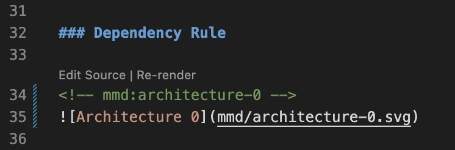

# Mermaid Diagram Management

[](https://marketplace.visualstudio.com/items?itemName=lekman.mmd)
[](https://www.npmjs.com/package/@lekman/mmd)
[](https://codecov.io/gh/lekman/mmd)

Extract, render, and inject themed SVGs into Markdown. Output matches the Mermaid Live Editor; optional framing (background, border, rounded corners) bakes the styling into the SVG so diagrams render correctly on GitHub, VS Code, Confluence, and Word exports.

<a href="docs/mmd/architecture-1.svg"></a>

## Installation

### VS Code Extension (recommended)

Install from the [VS Code Marketplace](https://marketplace.visualstudio.com/items?itemName=lekman.mmd). Provides CodeLens actions, on-save sync, and command palette integration.

### CLI (terminal, CI pipelines, AI agents)

Requires [Bun](https://bun.sh/) runtime.

```bash
bunx @lekman/mmd sync            # run directly
bun add -g @lekman/mmd           # or install globally
```

### AI Coding Assistant Rules

Installs rules for Claude Code, Cursor, and GitHub Copilot. Committed to the repo so all contributors benefit.

```bash
bunx @lekman/mmd init            # auto-detect and install
bunx @lekman/mmd init --all      # install all rule files
```

## Quick Start

### VS Code

1. Add a mermaid fenced block to any `.md` file
2. Click **"Convert to SVG"** on the CodeLens above the block
3. The block is extracted, rendered to a self-styled SVG, and replaced with an image tag
4. Edit the `.mmd` source file — SVGs re-render on save automatically

<a href="docs/assets/ide.png"></a>

### CLI / AI Agents

```bash
bunx @lekman/mmd convert README.md     # convert blocks in a file
bunx @lekman/mmd sync                  # sync all .md files
bunx @lekman/mmd render --force        # re-render after editing .mmd
```

## Commands

| Command | Description |
| ------- | ----------- |
| `mmd convert <file>` | Convert mermaid blocks to SVG references |
| `mmd sync [files...]` | Extract + render + inject (use `--force` to re-render all) |
| `mmd render [files...]` | Render stale `.mmd` to `.svg` |
| `mmd extract [files...]` | Extract fenced blocks to `.mmd` files |
| `mmd inject [files...]` | Update anchor comments with image tags |
| `mmd check [files...]` | Lint for orphaned inline mermaid blocks |
| `mmd config` | Write default `.mermaid.json` |
| `mmd init` | Install AI assistant rules (`--all`, `--claude`, `--cursor`, `--copilot`) |

## Configuration

Place a `.mermaid.json` in your repository root:

```json
{
  "outputDir": "docs/mmd",
  "mode": "light",
  "renderWidth": 1200,
  "svgStyle": {
    "background": "#ffffff",
    "borderColor": "#cccccc",
    "borderRadius": 10,
    "padding": 20
  }
}
```

Run `mmd config` to generate a full config with light and dark themes matching GitHub's color palettes.

| Field | Description |
| ----- | ----------- |
| `outputDir` | Directory for `.mmd` and `.svg` files |
| `mode` | `"light"` or `"dark"` theme selection (used when a diagram has no author frontmatter) |
| `renderWidth` | Puppeteer viewport width for mmdc (default: 1200) |
| `svgStyle` | Optional. Background, border, corner radius, padding baked into SVGs. Omit for raw Mermaid output. |
| `themes` | Light and dark Mermaid theme variables |

Author frontmatter wins: if a `.mmd` file starts with `---\nconfig:\n  theme: dark\n---`, the workspace theme is not injected. The diagram renders exactly as it would in the Mermaid Live Editor.

## Renderer

Uses [`@mermaid-js/mermaid-cli`](https://github.com/mermaid-js/mermaid-cli) (mmdc) — a Puppeteer-driven headless Chromium running the canonical `mermaid` library. Output matches `mermaid.live` for all 15 supported diagram types (flowchart, sequence, class, state, ER, C4, gantt, pie, gitgraph, mindmap, timeline, quadrant, kanban, requirement, architecture).

The first render downloads Puppeteer's bundled Chromium (one-time per machine).

## Documentation

| Document | Audience |
| -------- | -------- |
| [Architecture](docs/ARCHITECTURE.md) | C4 diagrams, Clean Architecture layers, data flow |
| [Contributing](docs/CONTRIBUTING.md) | Dev setup, task commands, CI/CD, release process |
| [Quality Assurance](docs/QA.md) | TDD workflow, coverage targets, test strategy |
| [Security](docs/SECURITY.md) | Vulnerability reporting, threat model |
| [Changelog](docs/CHANGELOG.md) | Release history |
| [Examples](examples/) | `.mmd` files for all 15 supported diagram types |

## License

[MIT](LICENSE)

