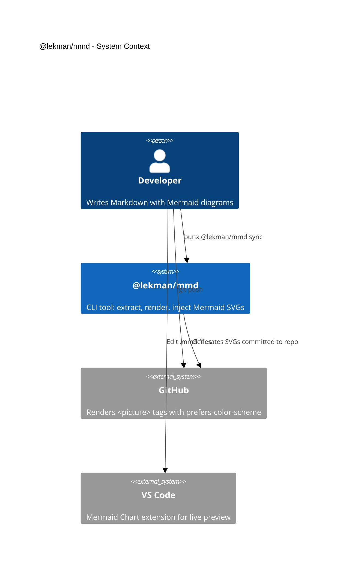
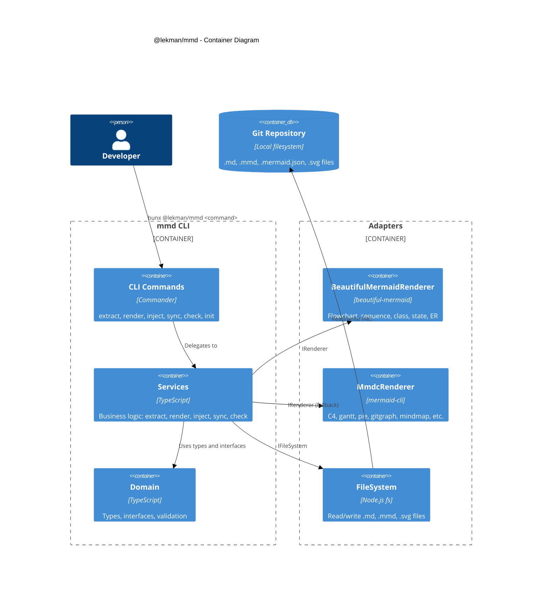
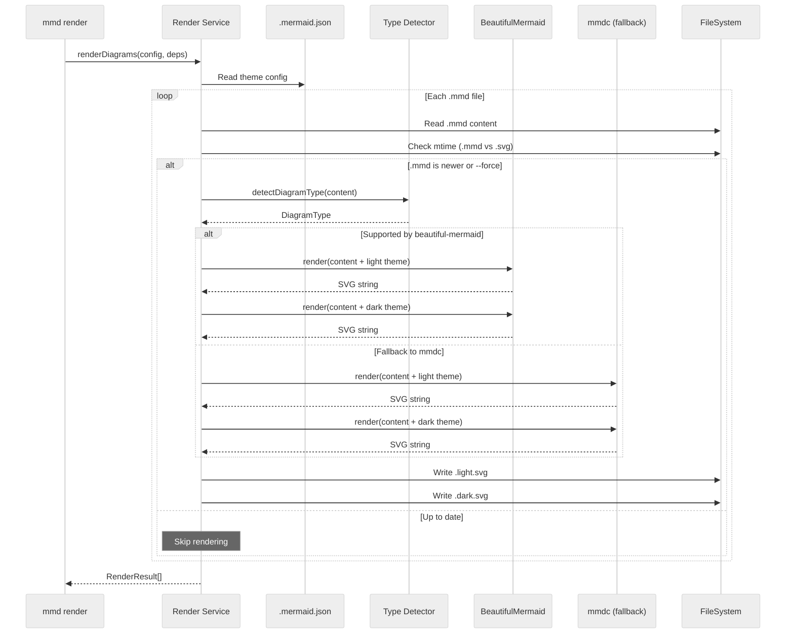

# Architecture

**Audience**: Developers and contributors working on @lekman/mmd.

## System Context (C4 Level 1)

The system context shows how @lekman/mmd fits into a developer's workflow. The CLI operates locally within a Git repository — no external services are required during normal operation.

<div style="background: white; background-color: white; padding: 0px; border: 1px solid #ccc; border-radius: 10px;">



</div>

## Container Diagram (C4 Level 2)

The container diagram shows the internal components of the CLI and how they interact with the local filesystem.

<div style="background: white; background-color: white; padding: 0px; border: 1px solid #ccc; border-radius: 10px;">



</div>

## Clean Architecture Layers

Dependencies point inward. Business logic never imports from infrastructure.

| Layer | Directory | Dependencies | Responsibility |
| ----- | --------- | ------------ | -------------- |
| Domain | `src/domain/` | None | Types, interfaces, validation, diagram detection |
| Services | `src/services/` | Domain only | Business logic: extract, render, inject, sync, check, init |
| Adapters | `src/adapters/` | Domain interfaces | Renderer and filesystem implementations |
| CLI | `src/cli/` | Services, adapters | Argument parsing, wiring dependencies |

### Dependency Rule

```
CLI → Services → Domain ← Adapters
         ↑                    ↑
         └────── uses ────────┘
         (via interface injection)
```

- `domain/` has zero external imports
- `services/` depend on interfaces from `domain/`, never on `adapters/`
- `adapters/` implement interfaces from `domain/`
- `cli/` wires adapters to services via dependency injection

## Directory Structure

```
src/
  domain/
    types.ts              # MermaidBlock, ThemeConfig, RenderResult, DiagramType
    interfaces.ts         # IRenderer, IFileSystem, IExtractor, IInjector
  services/
    extract.ts            # Extract mermaid blocks from markdown
    render.ts             # Render .mmd files to SVG
    inject.ts             # Inject <picture> tags into markdown
    sync.ts               # Orchestrate extract → render → inject
    check.ts              # Lint for orphaned inline blocks
    init.ts               # Install AI skill files
  adapters/
    beautiful-mermaid-renderer.system.ts   # beautiful-mermaid API
    mmdc-renderer.system.ts                # mermaid-cli subprocess
    filesystem.system.ts                   # Node.js file operations
  cli/
    index.ts              # Commander entry point
    commands/             # One file per CLI command
    shared.ts             # Factory functions for adapters
  templates/
    claude-skill.md       # Claude Code SKILL.md template
    cursor-rule.mdc       # Cursor .mdc template
    copilot-instructions.md  # GitHub Copilot template
```

### System File Convention

Files with external I/O use the `*.system.ts` suffix. These files are excluded from unit test coverage because they depend on real infrastructure (filesystem, renderer binaries).

| File | External Dependency |
| ---- | ------------------- |
| `beautiful-mermaid-renderer.system.ts` | beautiful-mermaid npm package |
| `mmdc-renderer.system.ts` | `@mermaid-js/mermaid-cli` subprocess |
| `filesystem.system.ts` | Node.js `fs` module |

## Rendering Pipeline

The render service processes each `.mmd` file through a dual-theme pipeline:

<div style="background: white; background-color: white; padding: 0px; border: 1px solid #ccc; border-radius: 10px;">



</div>

### Rendering Steps

1. Read `.mermaid.json` from the repository root
2. For each `.mmd` file in `outputDir`:
   - Compare `.mmd` mtime against `.svg` mtime (skip if up to date)
   - Detect diagram type from the first non-comment line
   - Select renderer: beautiful-mermaid for supported types, mmdc for others
   - Prepend light theme as `%%{init: ...}%%`, render to `<name>.light.svg`
   - Prepend dark theme as `%%{init: ...}%%`, render to `<name>.dark.svg`

## Technology Stack

| Component | Technology | Purpose |
| --------- | ---------- | ------- |
| Runtime | Bun | JavaScript/TypeScript runtime and package manager |
| Language | TypeScript (strict) | Type-safe source code |
| CLI framework | Commander | Command and option parsing |
| Primary renderer | beautiful-mermaid | Zero-DOM SVG rendering (flowchart, sequence, class, state, ER) |
| Fallback renderer | @mermaid-js/mermaid-cli | Puppeteer-based rendering for remaining diagram types |
| Linting | Biome | Formatting and lint rules |
| Testing | Bun test runner | Unit tests with coverage |
| Pre-commit | Husky | Runs lint and typecheck before commit |
| Security | Semgrep | Static analysis in CI |
| CI/CD | GitHub Actions | Build, test, publish pipeline |
| Versioning | release-please | Automated releases from conventional commits |

## Data Flow

### Extract Flow

```
**/*.md files
  │
  ├─ Scan for ```mermaid fenced blocks
  │
  ├─ For each block:
  │   ├─ Generate name from file path + block index
  │   ├─ Detect diagram type from first line
  │   ├─ Write content to docs/mmd/<name>.mmd
  │   └─ Replace fenced block with <!-- mmd:name --> anchor
  │
  └─ Updated .md files with anchors
```

### Inject Flow

```
**/*.md files
  │
  ├─ Scan for <!-- mmd:name --> anchor comments
  │
  ├─ For each anchor:
  │   ├─ Compute relative path from .md to SVGs
  │   └─ Generate <picture> tag with prefers-color-scheme sources
  │
  └─ Updated .md files with <picture> tags
```

### Sync Flow

```
mmd sync [--force]
  │
  ├─ 1. Extract: .md → .mmd files + anchor comments
  ├─ 2. Render:  .mmd → .light.svg + .dark.svg
  └─ 3. Inject:  anchors → <picture> tags
```

## Interface Boundaries

| Interface | Location | Purpose | Implementations |
| --------- | -------- | ------- | --------------- |
| `IRenderer` | `domain/interfaces.ts` | Render `.mmd` content to SVG string | `BeautifulMermaidRenderer`, `MmdcRenderer` |
| `IFileSystem` | `domain/interfaces.ts` | Read/write files, check mtimes, glob | `NodeFileSystem` (production), mock (test) |
| `IExtractor` | `domain/interfaces.ts` | Parse Markdown and extract Mermaid blocks | `RegexExtractor` |
| `IInjector` | `domain/interfaces.ts` | Replace anchors with `<picture>` tags | `PictureTagInjector` |

### Dependency Injection

Services accept an optional `deps` parameter for testability:

```typescript
export async function renderDiagrams(config: ThemeConfig, deps?: {
  renderer?: IRenderer;
  fallbackRenderer?: IRenderer;
  fs?: IFileSystem;
  mmdFiles?: string[];
  force?: boolean;
}) { ... }
```

In production, `cli/shared.ts` creates real adapter instances. In tests, mock implementations are passed directly.

## Extension Points

### Adding a New Renderer

1. Implement `IRenderer` from `src/domain/interfaces.ts`:

    ```typescript
    import type { DiagramType, IRenderer } from "../domain/interfaces.ts";

    export class NewRenderer implements IRenderer {
      readonly supportedTypes: ReadonlySet<DiagramType> = new Set(["flowchart"]);

      async render(content: string): Promise<string> {
        // Return SVG string
      }
    }
    ```

2. Register in `src/cli/shared.ts` factory functions.

3. Add unit tests in `tests/unit/adapters/`.

### Adding a New Diagram Type

1. Add the type to the `DiagramType` union in `src/domain/types.ts`.
2. Add the detection pattern to `DIAGRAM_PATTERNS` in the same file.
3. Add the type to the appropriate renderer's `supportedTypes` set.
4. Add an example `.mmd` file in `examples/`.
5. Add test cases for type detection.
